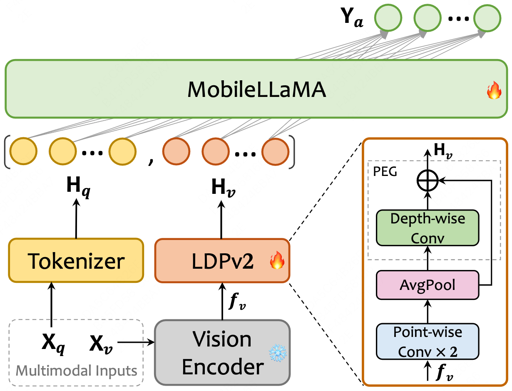

<h1 align="center">
MobileVLM: Vision Language Model for Mobile Devices
</h1>

<h5 align="center">

[](https://huggingface.co/mtgv)
[](https://github.com/tatsu-lab/stanford_alpaca/blob/main/LICENSE)
[](https://github.com/Meituan-AutoML/MobileVLM.git)[](https://github.com/Meituan-AutoML/MobileVLM.git)  

</h5>

* **MobileVLM V2: Faster and Stronger Baseline for Vision Language Model** <br>
  [](https://arxiv.org/abs/2402.03766)
  [](https://github.com/Meituan-AutoML/MobileVLM?tab=readme-ov-file#%EF%B8%8F-reference)

  <details> 
  <summary> 📌 Take a quick look at our MobileVLM V2 architecture </summary> 
  
  <br>
  We introduce MobileVLM V2, a family of significantly improved vision language models upon MobileVLM, which proves that a delicate orchestration of novel architectural design, an improved training scheme tailored for mobile VLMs, and rich high-quality dataset curation can substantially benefit VLMs’ performance. Specifically, MobileVLM V2 1.7B achieves better or on-par performance on standard VLM benchmarks compared with much larger VLMs at the 3B scale. Notably, our 3B model outperforms a large variety of VLMs at the 7B+ scale.
  
  <br>
  <p align="center"></p>

  *MobileVLM V2’s architecture. X<sub>v</sub> and X<sub>q</sub> indicate image and language instruction, respectively, and Y<sub>a</sub> refers to the text response from the language model MobileLLaMA. The diagram in the lower right corner is a detailed description of LDPv2, i.e., the lightweight downsample projector v2.*
  
  <br>
  </details>

* **MobileVLM: A Fast, Strong and Open Vision Language Assistant for Mobile Devices** <br>
  [](https://arxiv.org/abs/2312.16886) 
  [](https://github.com/Meituan-AutoML/MobileVLM?tab=readme-ov-file#%EF%B8%8F-reference)

  <details> 
  <summary> 📌 Take a quick look at our MobileVLM architecture </summary> 

  <br>
  We present MobileVLM, a competent multimodal vision language model (MMVLM) targeted to run on mobile devices. It is an amalgamation of a myriad of architectural designs and techniques that are mobile-oriented, which comprises a set of language models at the scale of 1.4B and 2.7B parameters, trained from scratch, a multimodal vision model that is pre-trained in the CLIP fashion, cross-modality interaction via an efficient projector. We evaluate MobileVLM on several typical VLM benchmarks. Our models demonstrate on par performance compared with a few much larger models. More importantly, we measure the inference speed on both a Qualcomm Snapdragon 888 CPU and an NVIDIA Jeston Orin GPU, and we obtain state-of-the-art performance of 21.5 tokens and 65.3 tokens per second, respectively.
  
  <br>
  <p align="center"></p>
  
  *The MobileVLM architecture (right) utilizes MobileLLaMA as its language model, intakes X<sub>v</sub> and X<sub>q</sub> which are image and language instructions as respective inputs and gives Y<sub>a</sub> as the output language response. LDP refers to a lightweight downsample projector.*

  <br>
  </details>


## 📸 Release

* ⏳ MobileLLaMA Pre-training code.
* **`Feb. 26th, 2024`**: MobileVLM V2 training data and code are available now! Follow the instructions below to train your own mobileVLM V2 model !
* **`Feb. 06th, 2024`**: 🔥🔥🔥 **MobileVLM V2** is out! Paper [here](https://arxiv.org/abs/2402.03766)! The inference code of MobileVLM V2 is available now! Our MobileVLM V2 weights are publicly available on the HuggingFace website. Enjoy [them](https://huggingface.co/mtgv/) !
* **`Feb. 06th, 2024`**: The SFT code and dataset of MobileLLaMA are released now! You can train your own chat model.
* **`Jan. 23rd, 2024`**: 🚀🚀🚀 **MobileVLM** is officially supported by [`llama.cpp`](https://github.com/ggerganov/llama.cpp/blob/master/examples/llava/MobileVLM-README.md) now ! Have a try !
* **`Jan. 15th, 2024`**: Customized `llama.cpp` for **MobileVLM** and its [deployment instruction](#deployment-on-mobile-devices) on mobile devices.
* **`Jan. 11st, 2024`**: The training and evaluation codes of MobileVLM are available now! Follow these  step-by-step instructions below to easily train your own mobileVLM in **5 hours** ⚡️ !
* **`Dec. 31st, 2023`**: Our MobileVLM weights are uploaded on the HuggingFace website. We also provide inference examples for the MobileLLaMA/MobileVLM model so that anyone can enjoy [them](https://huggingface.co/mtgv/) early.
* **`Dec. 29th, 2023`**: Our MobileLLaMA weights are uploaded on the HuggingFace website. Enjoy [them](https://huggingface.co/mtgv/) !
* **`Dec. 28th, 2023`:** 🔥🔥🔥 We release **MobileVLM: A Fast, Strong and Open Vision Language Assistant for Mobile Devices** on arxiv. Refer to **[our paper](https://arxiv.org/abs/2312.16886)** for more details !

## 🦙 Model Zoo

#### MobileVLM Family
| Model | LLM | GQA | SQA<sup>I</sup> | VQA<sup>T</sup> | POPE | MME<sup>P</sup>  | MMB<sup>dev</sup> | Avg. |
|-------|-------|---|-------|-------|-------|-------|-------|-------|
| <div style="width: 93pt"> [MobileVLM-1.7B](https://huggingface.co/mtgv/MobileVLM-1.7B)    | <div style="width: 91pt"> [MobileLLaMA 1.4B](https://huggingface.co/mtgv/MobileLLaMA-1.4B-Chat) | 56.1   | 57.3  | 41.5  | 84.5 | 1196.2 | 53.2    | 58.7 |
| [MobileVLM V2 1.7B](https://huggingface.co/mtgv/MobileVLM_V2-1.7B) | [MobileLLaMA 1.4B](https://huggingface.co/mtgv/MobileLLaMA-1.4B-Chat) | **59.3**   | **66.7**  | **52.1**  | **84.3** | **1302.8** | **57.7**    | **64.2** |
| [MobileVLM-3B](https://huggingface.co/mtgv/MobileVLM-3B)      | [MobileLLaMA 2.7B](https://huggingface.co/mtgv/MobileLLaMA-2.7B-Chat) |  59.0   | 61.2  | 47.5  | 84.9 | 1288.9 | 59.6    | 62.8 |
| [MobileVLM V2 3B](https://huggingface.co/mtgv/MobileVLM_V2-3B)   | [MobileLLaMA 2.7B](https://huggingface.co/mtgv/MobileLLaMA-2.7B-Chat) |  **61.1**   | **70.0**  | **57.5**  | **84.7** | **1440.5** | **63.2**    | **68.1** |
| [MobileVLM V2 7B](https://huggingface.co/mtgv/MobileVLM_V2-7B)   | [Vicuna-7B](https://huggingface.co/lmsys/vicuna-7b-v1.5)       |  **62.6**   | **74.8**  | **62.3**  | **85.3** | **1560.7** | **69.2**    | **72.1** |

#### MobileLLaMA Family
  - [MobileLLaMA-1.4B-Base](https://huggingface.co/mtgv/MobileLLaMA-1.4B-Base)
  - [MobileLLaMA-1.4B-Chat](https://huggingface.co/mtgv/MobileLLaMA-1.4B-Chat)
  - [MobileLLaMA-2.7B-Base](https://huggingface.co/mtgv/MobileLLaMA-2.7B-Base)
  - [MobileLLaMA-2.7B-Chat](https://huggingface.co/mtgv/MobileLLaMA-2.7B-Chat)

🔔 **Usage and License Notices**: This project utilizes certain datasets and checkpoints that are subject to their respective original licenses. Users must comply with all terms and conditions of these original licenses. This project is licensed permissively under the Apache 2.0 license and does not impose any additional constraints. <sup>[LLaVA](https://github.com/haotian-liu/LLaVA/tree/main?tab=readme-ov-file#release)</sup>


## 🛠️ Install

1. Clone this repository and navigate to MobileVLM folder
   ```bash
   git clone https://github.com/Meituan-AutoML/MobileVLM.git
   cd MobileVLM
   ```

2. Install Package
    ```Shell
    conda create -n mobilevlm python=3.10 -y
    conda activate mobilevlm
    pip install --upgrade pip
    pip install -r requirements.txt
    ```

## 🗝️ Quick Start

#### Example for MobileLLaMA model inference
```python
import torch
from transformers import LlamaTokenizer, LlamaForCausalLM

model_path = 'mtgv/MobileLLaMA-1.4B-Chat'

tokenizer = LlamaTokenizer.from_pretrained(model_path)
model = LlamaForCausalLM.from_pretrained(
    model_path, torch_dtype=torch.float16, device_map='auto',
)

prompt = 'Q: What is the largest animal?\nA:'
input_ids = tokenizer(prompt, return_tensors="pt").input_ids

generation_output = model.generate(
    input_ids=input_ids, max_new_tokens=32
)
print(tokenizer.decode(generation_output[0]))
```
* For more advanced usage, please follow the [transformers LLaMA documentation](https://huggingface.co/docs/transformers/main/model_doc/llama).

#### Example for MobileVLM/MobileVLM V2 model inference

```python
from scripts.inference import inference_once
# model_path = "mtgv/MobileVLM-1.7B" # MobileVLM
model_path = "mtgv/MobileVLM_V2-1.7B" # MobileVLM V2
image_file = "assets/samples/demo.jpg"
prompt_str = "Who is the author of this book?\nAnswer the question using a single word or phrase."
# (or) What is the title of this book?
# (or) Is this book related to Education & Teaching?

args = type('Args', (), {
    "model_path": model_path,
    "image_file": image_file,
    "prompt": prompt_str,
    "conv_mode": "v1",
    "temperature": 0, 
    "top_p": None,
    "num_beams": 1,
    "max_new_tokens": 512,
    "load_8bit": False,
    "load_4bit": False,
})()

inference_once(args)
```

## 🪜 Step-by-step Tutorial

### MobileVLM

The training process of MobileVLM V2 is divided into two stages:

- stage I: pre-training
  - ❄️ frozen vision encoder + 🔥 **learnable** LDP V2 projector + 🔥 **learnable** LLM
  - this training process takes around **3~5 hours** for MobileVLM V2-1.7B/3B on 8x A100 (80G) with a batch size of 256 and an average of approximately 38G/51G of GPU memory required.
- stage II: multi-task training
  - ❄️ frozen vision encoder + 🔥 **learnable** LDP V2 projector + 🔥 **learnable** LLM
  - this training process takes around **9~12 hours** for MobileVLM V2-1.7B/3B on 8x A100 (80G) with a batch size of 128 and an average of approximately 45G/52G of GPU memory required.
- *note: if you are interest in MobileVLM V1 training recipe, please refer to our previous [README](https://github.com/Meituan-AutoML/MobileVLM/tree/mobilevlm-v1).*

#### 1️⃣ Prepare MobileLLaMA checkpoints

Similar to MobileVLM, please firstly download MobileLLaMA chatbot checkpoints from huggingface website (🤗 [1.7B](https://huggingface.co/mtgv/MobileLLaMA-1.4B-Chat), [2.7B](https://huggingface.co/mtgv/MobileLLaMA-3B-Chat)). Please note that this is **optional** (it depends on your working environment), run the training script we provide below and the model will be automatically downloaded by the `transformers` library.

#### 2️⃣ Prepare data
- For convenience, assume your working directory `/path/to/project/mobilevlm` as `work_dir`: 
  - `cd ${work_dir} && mkdir -p data/pretrain_data data/finetune_data data/benchmark_data`
- prepare pre-training data
  - `cd ${work_dir}/data/pretrain_data`
  - download the ShareGPT4V-PT from [here](https://huggingface.co/datasets/Lin-Chen/ShareGPT4V/blob/main/share-captioner_coco_lcs_sam_1246k_1107.json), which is provided by ShareGPT4V team.
- prepare multi-task training data
  - `cd ${work_dir}/data/finetune_data`
  - download the annotation of our MobileVLM_V2_FT_Mix2M data from huggingface [here](https://huggingface.co/datasets/mtgv/MobileVLM_V2_FT_Mix2M), and download the images from constituting datasets: 
  [Text-VQA](https://dl.fbaipublicfiles.com/textvqa/images/train_val_images.zip), 
  [IConQA](https://drive.google.com/file/d/1Xqdt1zMcMZU5N_u1SAIjk-UAclriynGx/edit), [SQA](https://drive.google.com/drive/folders/1w8imCXWYn2LxajmGeGH_g5DaL2rabHev), [SBU](https://huggingface.co/datasets/sbu_captions), follow [ShareGPT4V](https://github.com/InternLM/InternLM-XComposer/blob/main/projects/ShareGPT4V/docs/Data.md) to download images from:
  [LAION-CC-SBU-558K](https://huggingface.co/datasets/liuhaotian/LLaVA-Pretrain/blob/main/images.zip), [COCO](http://images.cocodataset.org/zips/train2017.zip), [WebData](https://drive.google.com/drive/folders/1tCUQ-sq6vdshZVkF0ZeF3K4eztkXJgax?usp=sharing), [SAM](https://drive.google.com/file/d/1dKumdOKSXtV7lIXdrG7jsIK_z2vZv2gs/view?usp=drive_link), [GQA](https://downloads.cs.stanford.edu/nlp/data/gqa/images.zip), [OCR-VQA](https://drive.google.com/drive/folders/1_GYPY5UkUy7HIcR0zq3ZCFgeZN7BAfm_?usp=sharing), [TextVQA](https://dl.fbaipublicfiles.com/textvqa/images/train_val_images.zip), [VisualGnome](https://cs.stanford.edu/people/rak248/VG_100K_2) ([Part1](https://cs.stanford.edu/people/rak248/VG_100K_2/images.zip), [Part2](https://cs.stanford.edu/people/rak248/VG_100K_2/images2.zip))

- prepare benchmark data
  - We evaluate models on a diverse set of 6 benchmarks, *i.e.* GQA, MMBench, MME, POPE, SQA, TextVQA. We do not evaluate using beam search to make the inference process consistent with the chat demo of real-time outputs. You should follow these instructions to manage the datasets.
  - <details>
    <summary> Data Download Instructions </summary>

    - download some useful [data/scripts](https://github.com/Meituan-AutoML/MobileVLM/releases/download/v0.1/benchmark_data.zip) pre-collected by us.
      - `unzip benchmark_data.zip && cd benchmark_data`
      - `bmk_dir=${work_dir}/data/benchmark_data`
    - gqa
      - download its image data following the official instructions [here](https://cs.stanford.edu/people/dorarad/gqa/download.html)
      - `cd ${bmk_dir}/gqa && ln -s /path/to/gqa/images images`
    - mme
      - download the data following the official instructions [here](https://github.com/BradyFU/Awesome-Multimodal-Large-Language-Models/tree/Evaluation).
      - `cd ${bmk_dir}/mme && ln -s /path/to/MME/MME_Benchmark_release_version images`
    - pope
      - download coco from POPE following the official instructions [here](https://github.com/AoiDragon/POPE/tree/e3e39262c85a6a83f26cf5094022a782cb0df58d/output/coco).
      - `cd ${bmk_dir}/pope && ln -s /path/to/pope/coco coco && ln -s /path/to/coco/val2014 val2014`
    - sqa
      - download images from the `data/scienceqa` folder of the ScienceQA [repo](https://github.com/lupantech/ScienceQA).
      - `cd ${bmk_dir}/sqa && ln -s /path/to/sqa/images images`
    - textvqa
      - download images following the instructions [here](https://dl.fbaipublicfiles.com/textvqa/images/train_val_images.zip).
      - `cd ${bmk_dir}/textvqa && ln -s /path/to/textvqa/train_images train_images`
    - mmbench
      - no action is needed.

    </details>

- organize the `data` directory as follows after downloading all of them: 
  - <details>
    <summary> Data Structure Tree </summary>

    ```
    .
    ├── benchmark_data
    │   ├── gqa
    │   │   ├── convert_gqa_for_eval.py
    │   │   ├── eval.py
    │   │   ├── images -> /path/to/your/gqa/images
    │   │   ├── llava_gqa_testdev_balanced.jsonl
    │   │   └── testdev_balanced_questions.json
    │   ├── mmbench
    │   │   ├── convert_mmbench_for_submission.py
    │   │   ├── eval.py
    │   │   └── mmbench_dev_en_20231003.tsv
    │   ├── mme
    │   │   ├── calculation.py
    │   │   ├── convert_answer_to_mme.py
    │   │   ├── images -> /path/to/your/MME/MME_Benchmark_release_version
    │   │   └── llava_mme.jsonl
    │   ├── pope
    │   │   ├── coco -> /path/to/your/pope/coco
    │   │   ├── eval.py
    │   │   ├── llava_pope_test.jsonl
    │   │   └── val2014 -> /path/to/your/coco/val2014
    │   ├── sqa
    │   │   ├── eval.py
    │   │   ├── images -> /path/to/your/scienceqa/images
    │   │   ├── llava_test_CQM-A.json
    │   │   ├── pid_splits.json
    │   │   └── problems.json
    │   └── textvqa
    │       ├── eval.py
    │       ├── llava_textvqa_val_v051_ocr.jsonl
    │       ├── TextVQA_0.5.1_val.json
    │       └── train_images -> /path/to/your/textvqa/train_images
    ├── finetune_data
    │   ├── llava_v1_5_mix665k.json
    │   ├── MobileVLM_V2_FT_Mix2M.json
    │   ├── coco
    │   │   ├── train2017
    │   │   └── val2017
    │   ├── gqa
    │   │   └── images
    │   ├── iconqa_data
    │   │   └── iconqa
    │   │       └── train
    │   │           ├── choose_img
    │   │           ├── choose_txt
    │   │           └── fill_in_blank
    │   ├── ocr_vqa
    │   │   └── images
    │   ├── sam
    │   │   └── images
    │   ├── SBU
    │   │   └── images
    │   ├── ScienceQA
    │   │   └── train
    │   ├── share_textvqa
    │   │   └── images
    │   ├── textvqa
    │   │   └── train_images
    │   ├── vg
    │   │   ├── VG_100K
    │   │   └── VG_100K_2
    │   ├── web-celebrity
    │   │   └── images
    │   ├── web-landmark
    │   │   └── images
    │   └── wikiart
    │       └── images
    └── pretrain_data
        ├── share-captioner_coco_lcs_sam_1246k_1107.json
        ├── blip_laion_cc_sbu_558k.json
        ├── images
        ├── coco
        │   └── train2017
        ├── llava
        │   └── llava_pretrain
        └── sam
            └── images
    ```
    </details>

#### 3️⃣ Run everything with one click!
```shell
LANGUAGE_MODEL=/path/to/your/MobileLLaMA-1.4B-Chat  # or 2.7B
VISION_MODEL=/path/to/your/clip-vit-large-patch14-336
bash run.sh mobilevlm_v2_1.7b pretrain-finetune-test ${LANGUAGE_MODEL} ${VISION_MODEL}

# (test-only) bash run.sh mobilevlm_v2_1.7b test /path/to/your/own/checkpoint
# (3B) bash run.sh mobilevlm_v2_3b pretrain-finetune-test ${LANGUAGE_MODEL} ${VISION_MODEL}
```

- Note 🧭: We place all running commands in `run.sh` so they can be run with one click for simplification. If you would like to modify some super-parameters to observe their impact, please dive into `run.sh` to explore.


### MobileLLaMA

The SFT(supervised fine-tuning) process of MobileLLaMA: 
  - please refer to [MobileLLaMA_SFT.md](https://github.com/Meituan-AutoML/MobileVLM/blob/main/mobilellama/sft/MobileLLaMA_SFT.md) for the env, dataset and training code of our MobileLLaMA SFT.
  - this training process takes around **3~5 hours** for MobileLLaMA 1.4B/2.7B on 8x A100 (80G) 

Note: You may skip MobileLLaMA training processes and directly start with MobileVLM, leveraging our pre-trained MobileLLaMA model from huggingface website (🤗 [1.7B](https://huggingface.co/mtgv/MobileLLaMA-1.4B-Chat), [2.7B](https://huggingface.co/mtgv/MobileLLaMA-3B-Chat)). .

## <h2 id="deployment-on-mobile-devices">📲 Deployment on Mobile Devices </h2>
**MobileVLM** now is officially supported by `llama.cpp`. We are looking for more cooperation with open-source communities on the deployment of mobile devices.
- [llama.cpp](https://github.com/ggerganov/llama.cpp): the repository of official `llama.cpp`. Step-by-step deployment instructions are provided [here](https://github.com/ggerganov/llama.cpp/blob/master/examples/llava/MobileVLM-README.md).
## 🤝 Acknowledgments

- [LLaVA](https://github.com/haotian-liu/LLaVA): the codebase we built upon. Thanks for their wonderful work! 👏
- [Vicuna](https://github.com/lm-sys/FastChat): the amazing open-sourced large language model!
- [llama.cpp](https://github.com/ggerganov/llama.cpp): the great open-sourced framework for the inference of LLaMA model in pure C/C++!


## ✏️ Reference

If you find MobileVLM or MobileLLaMA useful in your research or applications, please consider giving a star ⭐ and citing using the following BibTeX:
```
@article{chu2023mobilevlm,
  title={Mobilevlm: A fast, reproducible and strong vision language assistant for mobile devices},
  author={Chu, Xiangxiang and Qiao, Limeng and Lin, Xinyang and Xu, Shuang and Yang, Yang and Hu, Yiming and Wei, Fei and Zhang, Xinyu and Zhang, Bo and Wei, Xiaolin and others},
  journal={arXiv preprint arXiv:2312.16886},
  year={2023}
}

@article{chu2024mobilevlm,
  title={MobileVLM V2: Faster and Stronger Baseline for Vision Language Model},
  author={Chu, Xiangxiang and Qiao, Limeng and Zhang, Xinyu and Xu, Shuang and Wei, Fei and Yang, Yang and Sun, Xiaofei and Hu, Yiming and Lin, Xinyang and Zhang, Bo and others},
  journal={arXiv preprint arXiv:2402.03766},
  year={2024}
}
```


## 🌟 Star History
<picture>
  <source
    media="(prefers-color-scheme: dark)"
    srcset="
      https://api.star-history.com/svg?repos=Meituan-AutoML/MobileVLM&type=Date&theme=dark
    "
  />

  <source
    media="(prefers-color-scheme: light)"
    srcset="
      https://api.star-history.com/svg?repos=Meituan-AutoML/MobileVLM&type=Date
    "
  />

  
</picture>

