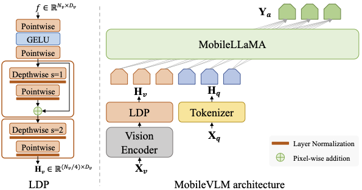

#  MobileVLM: A Fast, Strong and Open Vision Language Assistant for Mobile Devices

<a href='https://github.com/Meituan-AutoML/MobileVLM'></a>
<a href='https://arxiv.org/abs/2312.16886'></a>

We present MobileVLM, a competent multimodal vision language model (MMVLM) targeted to run on mobile devices. It is an amalgamation of a myriad of architectural designs and techniques that are mobile-oriented, which comprises a set of language models at the scale of 1.4B and 2.7B parameters, trained from scratch, a multimodal vision model that is pre-trained in the CLIP fashion, cross-modality interaction via an efficient projector. We evaluate MobileVLM on several typical VLM benchmarks. Our models demonstrate on par performance compared with a few much larger models. More importantly, we measure the inference speed on both a Qualcomm Snapdragon 888 CPU and an NVIDIA Jeston Orin GPU, and we obtain state-of-the-art performance of 21.5 tokens and 65.3 tokens per second, respectively.



Figure 1. The MobileVLM architecture (right) utilizes MobileLLaMA as its language model, intakes $\mathbf{X}_v$ and $\mathbf{X}_q$ which are image and language instructions as respective inputs and gives $\mathbf{Y}_a$ as the output language response. LDP refers to a lightweight downsample projector (left).

## Todo
- [x] MobileLLaMA weights and inference example.
- [ ] MobileVLM weights and inference code.
- [ ] MobileVLM training code.
- [ ] MobileLLaMA SFT training code.
- [ ] MobileLLaMA Pre-training code.

## Weights Release and Usage
We release MobileLLaMA weights in a PyTorch format can be conveniently used with the Hugging Face transformers library. Our checkpoint weights is licensed permissively under the Apache 2.0 license.

### Install
- Clone this repository and navigate to MobileVLM folder
```shell
git clone https://github.com/Meituan-AutoML/MobileVLM.git
cd MobileVLM
```

### MobileLLaMA weights

#### PyTorch weights for Hugging Face transformers:
- [MobileLLaMA-1.4B-Base](https://huggingface.co/mtgv/MobileLLaMA-1.4B-Base)
- [MobileLLaMA-1.4B-Chat](https://huggingface.co/mtgv/MobileLLaMA-1.4B-Chat)
- [MobileLLaMA-2.7B-Base](https://huggingface.co/mtgv/MobileLLaMA-2.7B-Base)
- [MobileLLaMA-2.7B-Chat](https://huggingface.co/mtgv/MobileLLaMA-2.7B-Chat)

#### Example for MobileLLaMA model inference
```python
import torch
from transformers import LlamaTokenizer, LlamaForCausalLM

model_path = 'mtgv/MobileLLaMA-1.4B-Base'

tokenizer = LlamaTokenizer.from_pretrained(model_path)
model = LlamaForCausalLM.from_pretrained(
    model_path, torch_dtype=torch.float16, device_map='auto',
)

prompt = 'Q: What is the largest animal?\nA:'
input_ids = tokenizer(prompt, return_tensors="pt").input_ids

generation_output = model.generate(
    input_ids=input_ids, max_new_tokens=32
)
print(tokenizer.decode(generation_output[0]))
```
For more advanced usage, please follow the [transformers LLaMA documentation](https://huggingface.co/docs/transformers/main/model_doc/llama).

#### Evaluating MobileLLaMA with LM-Eval-Harness
The model can be evaluated with [lm-eval-harness](https://github.com/EleutherAI/lm-evaluation-harness). 


### MobileVLM weights 
Preparing.

## Reference

If you found MobileVLM or MobileLLaMA useful in your research or applications, please cite using the following BibTeX:
```
@misc{chu2023mobilevlm,
      title={MobileVLM: A Fast, Strong and Open Vision Language Assistant for Mobile Devices}, 
      author={Xiangxiang Chu and Limeng Qiao and Xinyang Lin and Shuang Xu and Yang Yang and Yiming Hu and Fei Wei and Xinyu Zhang and Bo Zhang and Xiaolin Wei and Chunhua Shen},
      year={2023},
      eprint={2312.16886},
      archivePrefix={arXiv},
      primaryClass={cs.CV}
}
```
